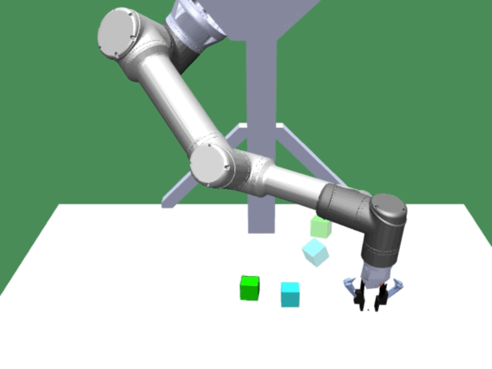
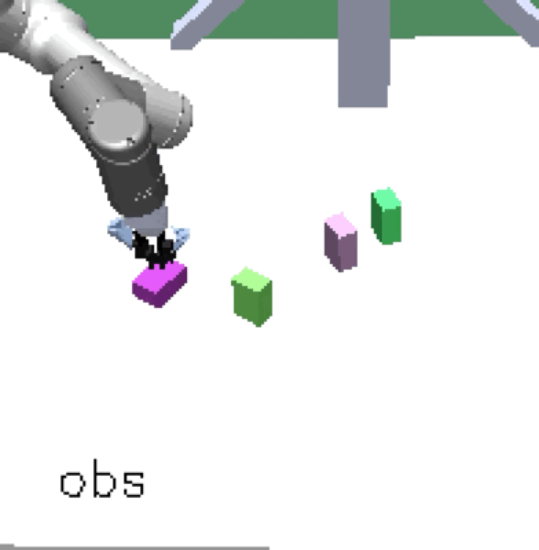
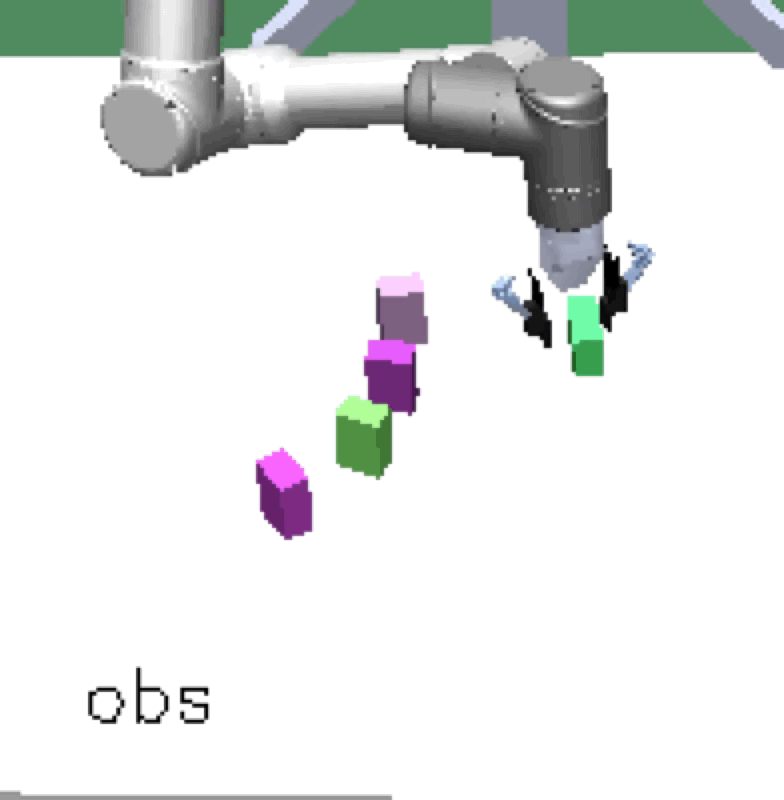
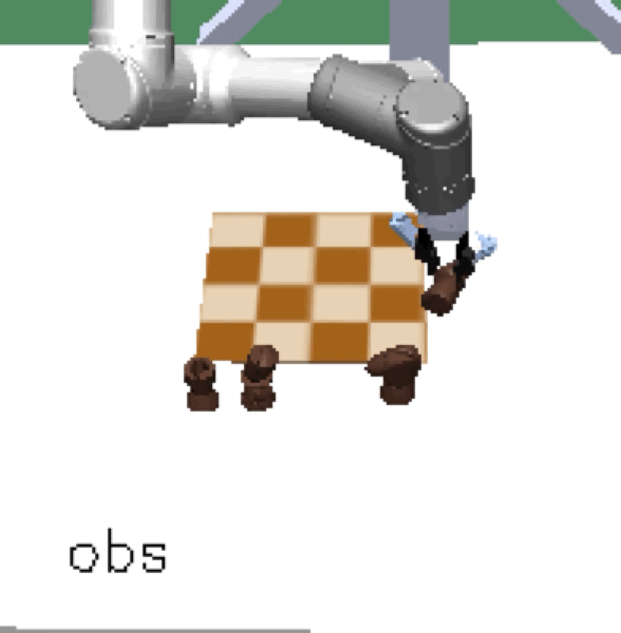

<!-- # Overview -->

[Paper](https://arxiv.org/abs/2101.04882) by OpenAI Robotics.

Cited as:
> OpenAI et al. ["Asymmetric self-play for automatic goal discovery in robotic manipulation"](https://arxiv.org/abs/2101.04882) NeuriPS 2020 Deep Reinforcement Learning Workshop.

We train a single, goal-conditioned policy that can solve many robotic manipulation tasks, including tasks with previously unseen goals and objects. To do so, we rely on asymmetric self-play for goal discovery, where two agents, Alice and Bob, play a game. Alice is asked to propose challenging goals and Bob aims to solve them. We show that this method is able to discover highly diverse and complex goals without any human priors. 

To the best of our knowledge, this is the first work that presents zero-shot generalization to many previously unseen tasks by training purely with asymmetric self-play.

## Zero-shot Generalization

Our method scales, resulting in **a single policy that can zero-shot generalize to many unseen hold-out tasks** such as setting a table, stacking blocks, and solving simple puzzles. Example holdout tasks involving unseen objects and complex goal states.

The first two columns are vision observations captured by the front and wrist cameras, respectively. The third column is a goal image, fixed per goal solving trial.

<table class="gif">
    <tr>
        <td><h5>Table Setting</h5></td>
        <td><video style="width: 100%;" autoplay loop muted>
            <source src="./assets/zero-shot/mini-table-setting-v2.mp4" type="video/mp4">
        </video></td>
    </tr>
    <tr>
        <td><h5>Ball Capture</h5></td>
        <td><video style="width: 100%;" autoplay loop muted>
            <source src="./assets/zero-shot/ballcap-v2.mp4" type="video/mp4">
        </video></td>
    </tr>
    <tr>
        <td><h5>5-Piece Dominos</h5></td>
        <td><video style="width: 100%;" autoplay loop muted>
            <source src="./assets/zero-shot/5-piece-domino-v2.mp4" type="video/mp4">
        </video></td>
    </tr>
    <tr>
        <td><h5>3-Piece Rainbow</h5></td>
        <td><video style="width: 100%;" autoplay loop muted>
            <source src="./assets/zero-shot/rainbow-3-pieces-v2.mp4" type="video/mp4">
        </video></td>
    </tr>
    <tr>
        <td><h5>Mini Chess</h5></td>
        <td><video style="width: 100%;" autoplay loop muted>
            <source src="./assets/zero-shot/mini-chess-v2.mp4" type="video/mp4">
        </video></td>
    </tr>
    <tr>
        <td><h5>Push 8 YCB Objects</h5></td>
        <td><video style="width: 100%;" autoplay loop muted>
            <source src="./assets/zero-shot/push-8-ycb-objects-v2.mp4" type="video/mp4">
        </video></td>
    </tr>
    <tr>
        <td><h5>Stacking 3 Blocks</h5></td>
        <td><video style="width: 100%;" autoplay loop muted>
            <source src="./assets/zero-shot/stack-3-blocks-v2.mp4" type="video/mp4">
        </video></td>
    </tr>
    <tr>
        <td><h5>Push 8 Blocks</h5></td>
        <td><video style="width: 100%;" autoplay loop muted>
            <source src="./assets/zero-shot/push-8-blocks-v2.mp4" type="video/mp4">
        </video></td>
    </tr>
</table>

## Novel Goals and Solutions

Alice discovers many goals that are not covered by our manually designed holdout tasks on blocks.
Although it is a tricky strategy for Bob to learn on its own, with **Alice Behavioral Cloning (ABC)**, Bob eventually acquires the skills for solving such complex tasks proposed by Alice.

<table class="gif">
    <tr>
        <td><h5>Novel Goals</h5></td>
        <td></td>
        <td></td>
        <td></td>
    </tr>
    <tr>
        <td><h5>Novel Solutions</h5></td>
        <td></td>
        <td></td>
        <td></td>
    </tr>
</table>

Complex manipulation skills can emerge from asymmetric self-play. The policy learns to exploit the environment dynamics (e.g. friction) to change object state and use complex arm movement to effectively grasp and rotate objects.

<table>
    <tr>
        <td><h5>Emergent Complex Skills</h5></td>
        <td></td>
        <td></td>
        <td></td>
    </tr>
</table>

<!-- ## Sample holdout videos

    <select id="class" name="class">
    </select>

    <select id="trial" name="trial">
        <option>Trial 1</option>
        <option>Trial 2</option>
        <option>Trial 3</option>
        <option>Trial 4</option>
        <option>Trial 5</option>
        <option>Trial 6</option>
        <option>Trial 7</option>
        <option>Trial 8</option>
        <option>Trial 9</option>
        <option>Trial 10</option>
    </select>

<video id="viewer" style="width: 100%;" controls muted>
    <source id="viewerSrc" src="" type="video/mp4">
</video>

-->

